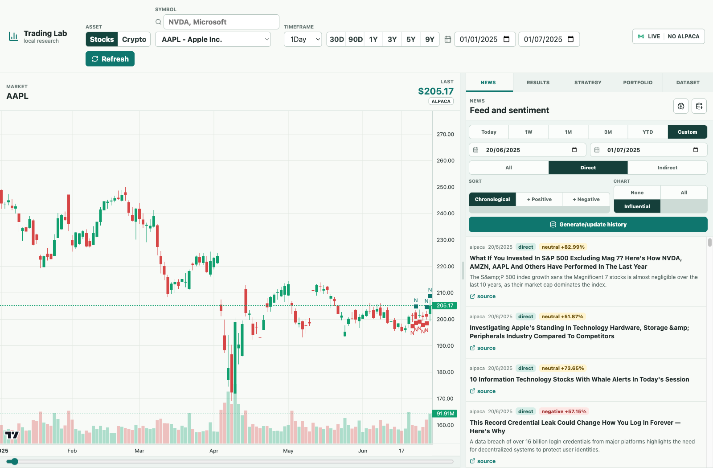
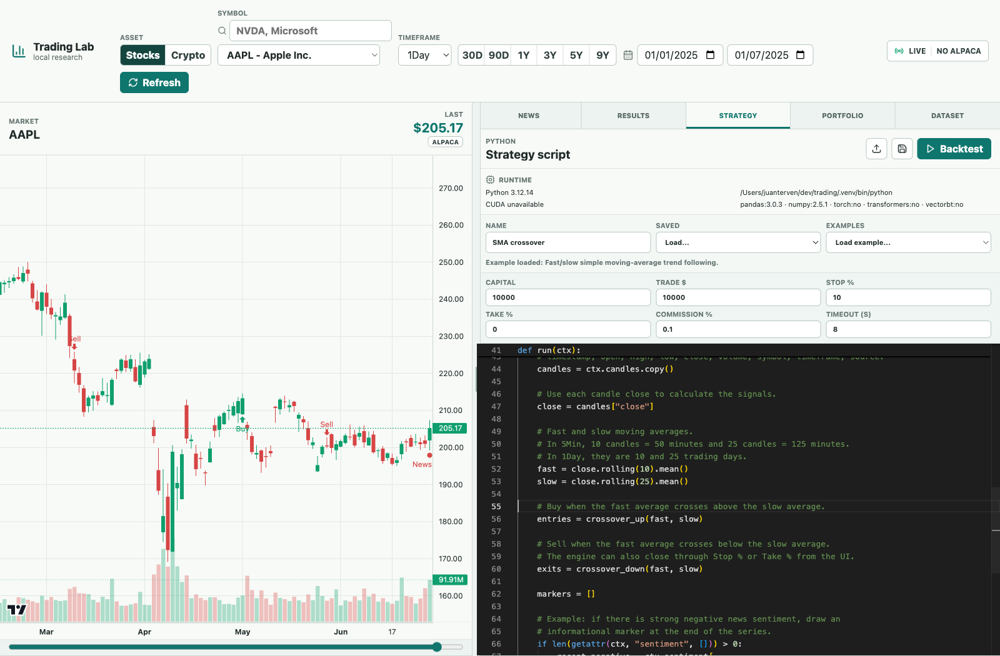
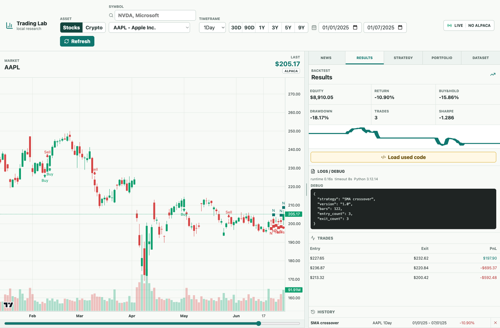

# Trading Lab

**A local workspace for market research, news sentiment, and Python strategy experiments.**

Explore stock/ETF and cryptocurrency candles, connect price moves with news, write a strategy, and inspect its backtest in one browser workspace. Historical data lives in DuckDB and can also be used independently of the platform.

[Quick start](#quick-start) · [Platform tour](docs/PLATFORM_GUIDE.md) · [First backtest](#run-your-first-backtest) · [Public datasets](#public-datasets) · [Strategy contract](docs/STRATEGY_SCRIPT_README.md)



*The running application on localhost, using saved AAPL data. The chart and news feed have independent date ranges.*

## Explore the platform

The chart stays on the left while the right panel switches between research tools. Drag the divider to make more room for news, code, or results.

| Workspace | What you can do |
| --- | --- |
| **Market chart** | Switch between Stocks and Crypto, select a symbol and timeframe, navigate candlesticks and volume, and inspect news and trade markers. |
| **News** | Read saved articles, filter direct/indirect relationships, sort by sentiment, and show news on the chart. Generate/update stock history through Alpaca. |
| **Strategy** | Edit Python in Monaco, load a `.py` file, choose a built-in example, save locally, and configure capital, position size, stops, commission, and timeout. |
| **Results** | Inspect equity, return, buy-and-hold comparison, drawdown, trade count, Sharpe, the equity curve, trades, logs, and saved runs. Reload the exact code used by a run. |
| **Dataset** | Check per-symbol news, sentiment, and candle coverage across all five timeframes before choosing a research window. |
| **Portfolio** | View Alpaca account balances/positions and submit manual orders to the configured trading endpoint, which defaults to Alpaca Paper Trading. |

**Current scope:** stock/ETF research includes local backtesting. Crypto supports charts, saved news/sentiment, and coverage inspection; crypto backtesting and portfolio integration are not wired yet. Backtests run locally and do not place broker orders.

See the **[illustrated platform guide](docs/PLATFORM_GUIDE.md)** for every panel, exact controls, and troubleshooting.

## Quick start

### 1. Install the environment

Use Python 3.12 or 3.13 and Node.js/npm. The supplied Conda environment installs Python 3.12 and Node.js 24:

```bash
git clone https://github.com/jrterven/trading.git
cd trading
cp .env.example .env
conda env create -f environment.yml
conda activate trading-lab
npm install
```

If you already have a `.env`, keep it and update the needed values rather than replacing it.

<details>
<summary>Prefer a Python virtual environment?</summary>

With Python and Node.js already installed:

```bash
python3.12 -m venv .venv
source .venv/bin/activate
# Windows PowerShell: .venv\Scripts\Activate.ps1
python -m pip install -e ".[test]"
npm install
```

Use the manual startup commands below; `start_services.sh` requires Conda.

</details>

### 2. Add data and optional provider access

Download the [public datasets](#public-datasets) and place them here before starting the app:

```text
data/
├── trading.duckdb          # stocks and ETFs
└── crypto/
    └── crypto.duckdb       # cryptocurrencies
```

The stock database path is configurable with `DUCKDB_PATH` in `.env`. Crypto uses `data/crypto/crypto.duckdb`.

To download fresh stock data, search provider symbols, or use the portfolio, set `ALPACA_API_KEY` and `ALPACA_SECRET_KEY` in `.env`. The default stock feed is `iex`; the trading endpoint defaults to `https://paper-api.alpaca.markets`. Saved datasets can be inspected without credentials. The stock workspace may show an Alpaca configuration message when it also tries to load the portfolio; see [offline use](docs/PLATFORM_GUIDE.md#using-saved-data-without-alpaca).

### 3. Start the app

```bash
./scripts/start_services.sh
```

Open **[Trading Lab on localhost](http://127.0.0.1:5173)**. The backend runs on port `8001`; interactive API documentation is at **[localhost:8001/docs](http://127.0.0.1:8001/docs)**.

```bash
# Stop both services.
./scripts/stop_services.sh

# Optional port overrides; use the same values when stopping.
BACKEND_PORT=8002 FRONTEND_PORT=5174 ./scripts/start_services.sh
BACKEND_PORT=8002 FRONTEND_PORT=5174 ./scripts/stop_services.sh
```

<details>
<summary>Manual startup and logs</summary>

Activate your Conda or virtual environment in terminal 1:

```bash
python -m uvicorn backend.main:app --host 127.0.0.1 --port 8001
```

In terminal 2 (macOS/Linux):

```bash
VITE_API_URL=http://127.0.0.1:8001 VITE_WS_URL=ws://127.0.0.1:8001 npm run dev -- --host 127.0.0.1 --port 5173
```

The explicit API/WS URLs are important: Vite's fallback proxy points to port `8000`. For PowerShell, set these two environment variables with `$env:VITE_API_URL` and `$env:VITE_WS_URL` before running `npm run dev`.

The service scripts write logs to `.run/logs/backend.log` and `.run/logs/frontend.log`. Manual servers stop with Ctrl+C in each terminal.

</details>

## Run your first backtest

1. Select **Stocks → AAPL → 1Day**. Set the top date range to **2025-01-01 → 2025-07-01**, which is present in the public snapshot.
2. Open **News** to inspect context. Its date range is independent; the screenshot uses **2025-06-20 → 2025-07-01**. Choose **Influential** to show a small set of sentiment-ranked news markers.
3. Open **Strategy**, choose **SMA crossover** from **Examples**, and inspect `run(ctx)`. The example uses 10- and 25-candle moving averages. The initial **Template** intentionally opens no trades.
4. Set **Capital = 10000**, **Trade $ = 10000**, **Stop % = 10**, **Take % = 0**, **Commission % = 0.1**, and **Timeout (s) = 8**, then click **Backtest**.
5. Read **Results**. Expand **Logs / Debug**, inspect the trades, and use **Load used code** to continue editing the exact strategy used in that run.



*Load an example, upload your own `.py` script, or write directly in the editor. The runtime panel shows the actual Python environment and installed packages.*



*An actual local run on the selected historical window: 122 candles and 3 trades. This screenshot documents the workflow and its observed result.*

Built-in examples include SMA/EMA crossover, RSI and Bollinger mean reversion, MACD momentum, Donchian breakout, and sentiment-filtered SMA. For the `run(ctx)` interface, time-aware news access, markers, and debugging, see the **[strategy script contract](docs/STRATEGY_SCRIPT_README.md)**.

## Research cryptocurrencies

Choose **Crypto**, select a pair such as **BTC/USD**, and set dates within its downloaded history. Use the same chart, News, and Dataset panels. **Refresh local crypto history** and **Load saved sentiment** read the local snapshot; they do not fetch new crypto history or run a new model.

[See the Bitcoin workspace and step-by-step crypto guide →](docs/PLATFORM_GUIDE.md#research-crypto)

## Public datasets

<a href="https://u.pcloud.link/publink/show?code=kZH4n4JZxvPDaHEN5CmTdmEonWGArQ6XpozX" target="_blank" rel="noopener noreferrer"><strong>Download trading.duckdb and crypto.duckdb from pCloud ↗</strong></a>

**Stay in the repository:** on GitHub, use **Cmd + click** (macOS) or **Ctrl + click** (Windows/Linux) to open the download in another tab. GitHub removes `target="_blank"` from rendered README links; the attribute works in compatible HTML viewers.

Each file is a self-contained DuckDB database of OHLCV candles, news, article-to-symbol links, precomputed FinBERT sentiment, and download logs. You can use either file without installing the app or obtaining API keys.

### What is in each file?

Inventory checked on **2026-09-25** against the local files; pCloud reports matching filenames and byte sizes. Date ranges are global first/last dates in UTC, not complete coverage for every symbol/timeframe.

| Content | `trading.duckdb` | `crypto.duckdb` |
| --- | --- | --- |
| Market | 38 US stock/ETF symbols, including AAPL, NVDA, SPY, QQQ | 20 USD crypto pairs, including BTC/USD, ETH/USD, SOL/USD |
| File size | 5,466,763,264 bytes (5.09 GiB) | 3,326,357,504 bytes (3.10 GiB) |
| OHLCV candles (`bars`) | 63,214,001 rows | 39,755,471 rows |
| Candle date range | 2017-01-03 to 2026-07-21 | 2021-01-01 to 2026-07-01 |
| Timeframes | `1Min`, `5Min`, `15Min`, `1Hour`, `1Day` | `1Min`, `5Min`, `15Min`, `1Hour`, `1Day` |
| Unique news articles (`news_articles`) | 253,514; 2014-11-07 to 2026-07-01 | 30,595; 2022-01-02 to 2026-07-01 |
| Article-to-symbol links (`news_article_symbols`) | 368,483 | 52,468 |
| Sentiment records (`sentiment_scores`) | 367,878; `ProsusAI/finbert` | 52,468; `ProsusAI/finbert` |
| Download records | 53,495 bar windows; 128,280 news windows | 14,160 bar windows; 1,340 news windows |
| Candle schema differences | Integer `volume` (`BIGINT`) | Fractional `volume` (`DOUBLE`), plus `trade_count` and `vwap` |
| Other tables | Empty app tables: `strategies`, `backtest_runs`, `trades`, `markers`, `paper_orders` | No app tables |

Both datasets were collected through Alpaca. Coverage varies: CVX candles end in August 2017, some crypto pairs start in 2026, and stock download logs include failed windows. The [data guide](docs/DATABASE_USAGE.md) explains sources, table definitions, joins, and actual coverage.

### Use the files independently

1. Download one or both `.duckdb` files. They open directly. If you download the folder as ZIP, [extract the archive first](docs/DATABASE_USAGE.md#download-and-open-the-data-independently).
2. Install just DuckDB: `python -m pip install duckdb==1.5.4`.
3. Copy [`read_dataset.py`](scripts/read_dataset.py) into your data directory to inspect or export the files:

```bash
python read_dataset.py --db crypto.duckdb inspect --coverage
python read_dataset.py --db trading.duckdb export \
  --table news_articles --output exports/stock_news.parquet
```

**[Complete standalone data guide →](docs/DATABASE_USAGE.md)** — download/unzip instructions, Python and SQL examples, CSV/Parquet export, all symbols, and time alignment for ML.

## Architecture and optional tools

| Layer | Implementation |
| --- | --- |
| Browser workspace | React, TypeScript, Vite, Lightweight Charts, Monaco Editor |
| API and storage | FastAPI, DuckDB, pandas, NumPy |
| Market/news provider | Alpaca; saved crypto data is read from its separate DuckDB file |
| Strategy execution | Python subprocess with a configurable timeout; local long-only simulation |
| Sentiment | Optional FinBERT; the public snapshots already contain scores |
| Broker integration | Alpaca trading API; paper endpoint by default |

For local FinBERT, install `python -m pip install -e ".[ai]"`. Optional Ollama support is configured with `OLLAMA_BASE_URL` and `OLLAMA_MODEL`; the default model can be downloaded with `ollama pull gpt-oss:20b`. The standard UI sentiment action does not request Ollama explanations. Strategies that need vectorbt can use the optional `.[backtest]` extra.

```text
frontend/src/components/    Chart, news, editor, results, dataset, portfolio
backend/main.py             HTTP API and market WebSocket
backend/services/          Data access, sentiment, strategy execution, backtesting
scripts/                   Startup, history downloads, standalone exports
samples/strategies/        Example strategy scripts
```

## Development

```bash
conda activate trading-lab
pytest
npm test
npm run build
```

After changing the Conda environment definition:

```bash
conda env update -f environment.yml --prune
```

**Documentation:** [Platform guide](docs/PLATFORM_GUIDE.md) · [Dataset guide](docs/DATABASE_USAGE.md) · [Strategy contract](docs/STRATEGY_SCRIPT_README.md)
