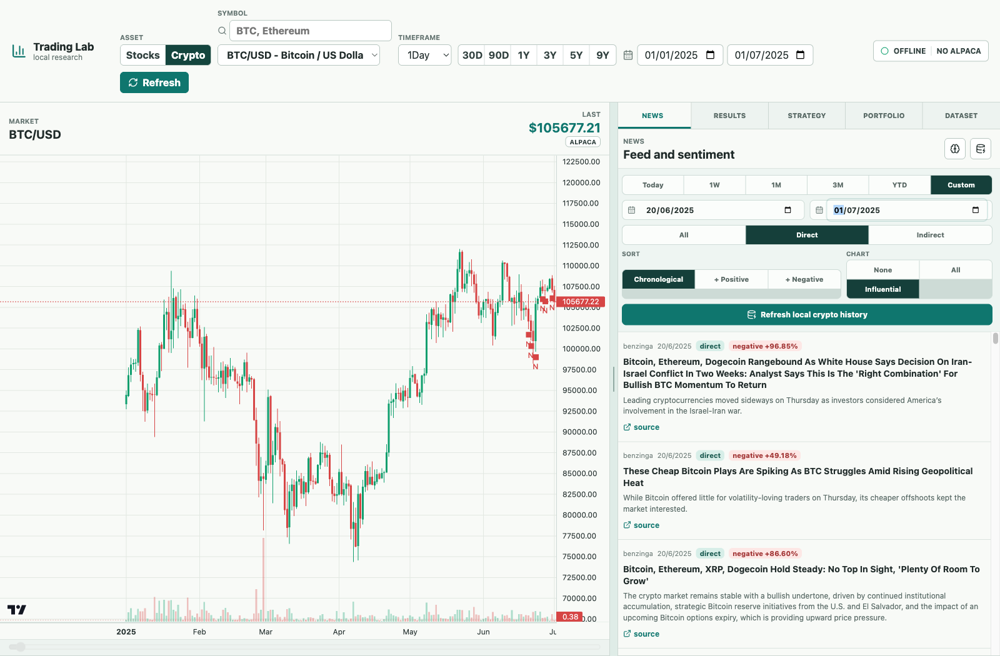
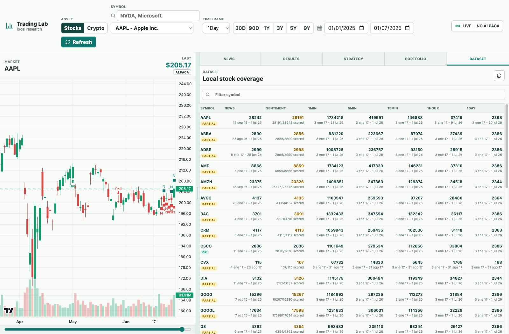
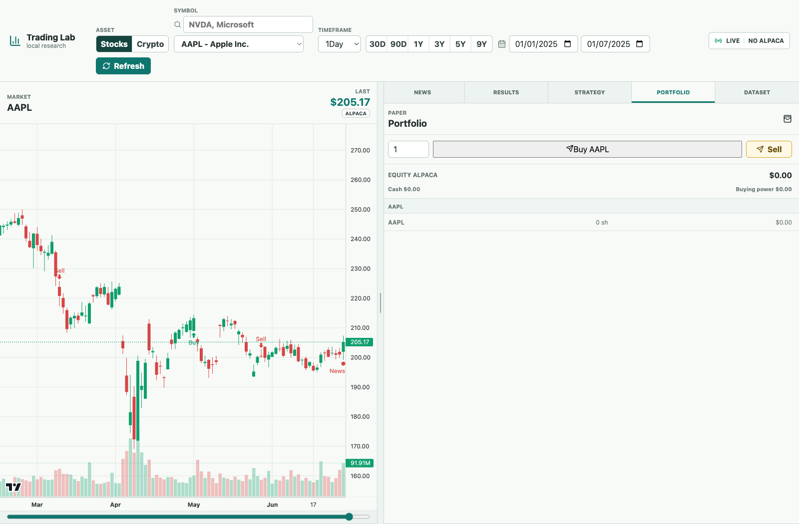

# Trading Lab · Platform Guide

A visual walkthrough of the local research workspace, from choosing a market to reviewing a saved backtest. Start with the [installation and launch instructions](../README.md#quick-start).

[Market workspace](#explore-the-market-workspace) · [News](#read-news-and-sentiment) · [Strategies](#write-or-load-a-strategy) · [Results](#run-and-review-a-backtest) · [Crypto](#research-crypto) · [Coverage](#check-dataset-coverage) · [Portfolio](#use-the-portfolio-panel) · [Troubleshooting](#troubleshooting)

The screenshots are real captures of the app running on localhost with the downloaded historical datasets. They were taken on 2026-09-25 without broker credentials. Backtests were saved to a working copy of the stock database; the published source files were not changed.

## Explore the market workspace


1. Choose **Stocks** or **Crypto** at the top. Switching asset class resets the symbol and date ranges, so set your dates again after switching.
2. Use **Symbol** to select an asset. The search box accepts ticker/name text; stock provider search requires Alpaca credentials, while the popular-symbol dropdown remains available locally.
3. Select a **Timeframe**: `1Min`, `5Min`, `15Min`, `1Hour`, or `1Day`.
4. Set the two top date inputs. For a reproducible first view, use **AAPL / 1Day / 2025-01-01 → 2025-07-01**. The preset buttons (`30D`, `90D`, `1Y`, `3Y`, `5Y`, `9Y`) are relative to today, so they may extend beyond a downloaded snapshot.
5. Use the chart to inspect candles, volume, and markers. Pan/zoom or use the horizontal scrollbar below it to navigate the series.

Changing symbol, timeframe, or dates reloads the view automatically. **Refresh** explicitly requests a stock-data refresh through the provider; the crypto view reloads its local data. The **Last** value is the final loaded candle's close and is not necessarily a current market quote.

Drag the vertical divider to resize the chart and right panel. This width is remembered in browser storage. The **News**, **Results**, **Strategy**, **Portfolio**, and **Dataset** tabs reuse the right panel without navigating away from the chart.

The **live/offline** badge describes the market WebSocket connection, and **Alpaca/no Alpaca** describes credential configuration. A connected WebSocket alone does not establish that new market data is arriving. The current crypto view uses local history and does not open the stock market stream.

## Read news and sentiment

Open **News** to inspect articles alongside the chart. Saved articles and scores load from the selected database.

| Control | How to use it |
| --- | --- |
| News date inputs | Set the article range independently of the top chart range. The overview screenshot uses `2025-06-20 → 2025-07-01`. |
| `Today`, `1W`, `1M`, `3M`, `YTD` | Quick news ranges relative to the current date. Use explicit dates for historical snapshots. |
| `All`, `Direct`, `Indirect` | Filter the article-to-symbol relationship. The published snapshots currently contain direct relationships. |
| `Chronological`, `+ Positive`, `+ Negative` | Sort by publication time or the corresponding sentiment probability. |
| Chart: `None`, `All`, `Influential` | Hide news markers, show all, or show up to 12 articles ranked by the larger positive/negative probability. “Influential” is a sentiment ranking, not a measured price-impact estimate. |
| Article card / chart marker | Select an article to focus the chart on its timestamp; click its marker to select the corresponding news card. |
| `source` | Open the original article. |

For stocks, **Generate/update history** downloads news and candle history for the chosen news range and scores pending articles. **Analyze sentiment** processes missing scores for the loaded news. New downloads require Alpaca credentials; existing stored scores do not require a model download.

For fresh local FinBERT scoring, install the optional `.[ai]` dependencies. If FinBERT cannot load, the backend falls back to its lexicon scorer; inspect stored model metadata when mixing datasets. The standard UI flow does not request Ollama explanations.

The sentiment badge is a model label and confidence. It is not a price forecast. For time-aware strategy code, use the helpers described in the [strategy contract](STRATEGY_SCRIPT_README.md#available-context).

## Write or load a strategy


Open **Strategy** and choose one of these starting points:

- **Examples** loads Template, SMA crossover, EMA crossover, RSI mean reversion, Bollinger mean reversion, MACD momentum, Donchian breakout, or Sentiment filtered SMA.
- **Load .py file** imports an existing Python script into the editor.
- **Saved** loads a previously saved local strategy.
- The Monaco editor lets you edit the Python source directly.

The initial **Template** intentionally emits no entries or exits. For a working first example, select **SMA crossover**, which compares 10- and 25-candle moving averages. On `1Day`, those windows represent trading-day candles; on `5Min`, they represent 50 and 125 minutes of candles.

The script must define `run(ctx)` and return aligned `entries` and `exits`. It can also return chart `markers` and JSON-compatible `debug` values. `ctx` exposes candles, news, sentiment, and timestamp-aware news/sentiment helpers.

```python
def run(ctx):
    close = ctx.candles["close"]
    fast = close.rolling(10).mean()
    slow = close.rolling(25).mean()
    return {
        "entries": (fast > slow) & (fast.shift(1) <= slow.shift(1)),
        "exits": (fast < slow) & (fast.shift(1) >= slow.shift(1)),
        "markers": [],
    }
```

Use **Name** to identify your strategy and **Save local strategy** to save it. Saving writes a `.py` file under `data/strategies/` and a database record. Importing or selecting an example only changes the editor; it does not save the strategy or execute it.

The **Runtime** panel shows the backend Python executable, package versions, and CUDA availability. Install additional strategy dependencies in that same environment. Each run executes in a separate Python subprocess with a timeout.

The [complete strategy contract](STRATEGY_SCRIPT_README.md) covers imports, helper functions, context fields, markers, logs, and debugging.

## Run and review a backtest

Backtesting is currently connected to the **Stocks** workspace. It uses the top symbol, timeframe, and date inputs plus the code currently in the editor. News/sentiment passed to a strategy follows the backtest interval, not just the visible News panel's range.

Set the parameters and click **Backtest**:

| Parameter | Meaning | Screenshot value |
| --- | --- | ---: |
| Capital | Starting simulated cash | `10000` |
| Trade $ | Cash budget per entry, limited by available cash; `0` uses available cash | `10000` |
| Stop % | Stop-loss distance from entry; `0` disables it | `10` |
| Take % | Take-profit distance from entry; `0` disables it | `0` |
| Commission % | Percentage charged per side; `0.1` means 0.1%, not 10% | `0.1` |
| Timeout (s) | Maximum strategy subprocess runtime, from 1 to 300 seconds | `8` |


The illustrated run uses **AAPL / 1Day / 2025-01-01 → 2025-07-01**, the built-in **SMA crossover**, and the parameters above. It loaded **122 candles**, completed **3 trades**, and produced **$8,910.05 final equity** from $10,000. These are the observed outputs of this example, not a performance claim about the strategy in other periods.

In **Results**:

- Compare **Equity**, **Return**, **Buy&Hold**, **Drawdown**, **Trades**, and **Sharpe**.
- Inspect the equity curve and the trade table. Entry/exit markers appear when the chart matches the run's symbol, timeframe, and dates.
- Expand **Logs / Debug** for captured stdout/stderr, structured debug output, runtime, and timeout.
- Choose a run in **History** to reopen its results and restore its chart selection.
- Use **Load used code** to return the exact stored source to the editor.
- Use a history row's delete button to remove a run; the UI asks for confirmation.

The engine is a local long-only simulation. Signals execute at candle close, and stops/targets use the candle's high/low. These execution assumptions matter when interpreting results. Keep signal inputs aligned in time; the [data guide](DATABASE_USAGE.md#time-alignment-for-research-and-ml) explains news availability. A backtest does not submit orders to Alpaca.

## Research crypto



1. Switch to **Crypto** and select **BTC/USD** (retain the slash in pair names).
2. Set the chart to **1Day**, **2025-01-01 → 2025-07-01**.
3. In **News**, set **2025-06-20 → 2025-07-01** to reproduce the screenshot.
4. Use **Refresh local crypto history** to reload saved articles and history summaries, or **Load saved sentiment** to read existing scores.
5. Open **Dataset** to compare coverage across the 20 stored crypto pairs.

The app reads `data/crypto/crypto.duckdb`. These UI actions do not download new crypto data or run a new sentiment model. A separate collection utility exists at [`scripts/backfill_crypto_dataset.py`](../scripts/backfill_crypto_dataset.py); it requires provider access and the collection dependencies.

Crypto backtesting and account portfolio integration are not wired into this flow. Use the [standalone export script](../scripts/read_dataset.py) to take crypto candles/news into an external research pipeline.

## Check dataset coverage



Open **Dataset** before selecting a research interval:

1. Choose **Stocks** or **Crypto** to select the underlying database.
2. Filter with **Filter symbol**.
3. Compare article counts, scored article/symbol counts, and candle counts/date ranges across `1Min`, `5Min`, `15Min`, `1Hour`, and `1Day`.
4. Click a symbol row to select it in the workspace.
5. Use **Refresh local summary** to recompute the display from the local database. This action does not download new history.

Widen the panel with the divider, or scroll the table horizontally on a smaller screen.

**Partial** indicates fewer sentiment scores than news relationships. **Missing** indicates no news or candles. **OK** is the panel's availability summary, not a certification of gap-free candles. Counts and date endpoints alone cannot establish continuous coverage. The [dataset guide](DATABASE_USAGE.md#snapshot-contents-and-coverage) explains the snapshot's known coverage differences and download logs.

## Use the portfolio panel



The **Portfolio** tab is the broker-connected part of the stock workspace. With Alpaca credentials configured, it loads equity, cash, buying power, and positions, grouped into the active symbol and other positions.

Set a share quantity and use **Buy [symbol]** or **Sell** to submit a manual order. These buttons call the configured trading API immediately; they are separate from the local backtest engine. `ALPACA_TRADING_BASE_URL` defaults to the Alpaca Paper Trading endpoint.

The screenshot shows the disconnected state: the panel displays zero-value placeholders, not balances fetched from an account. No account or order execution is demonstrated. Public data files do not include account credentials or populate this panel.

## Configuration and API

Edit `.env` and restart the backend when changing settings. The frontend uses `VITE_API_URL` and `VITE_WS_URL` when started; the service script sets both automatically.

| Setting | Purpose |
| --- | --- |
| `ALPACA_API_KEY`, `ALPACA_SECRET_KEY` | Provider authentication for fresh stock data and broker access |
| `ALPACA_DATA_FEED` | Stock feed, default `iex` |
| `ALPACA_TRADING_BASE_URL` | Trading endpoint, default Alpaca Paper Trading |
| `DUCKDB_PATH` | Stock/application database path, default `data/trading.duckdb` |
| `STRATEGY_TIMEOUT_SECONDS` | Default strategy timeout, overridden by the UI per run |
| `OLLAMA_BASE_URL`, `OLLAMA_MODEL` | Optional local language-model configuration |
| `ALLOWED_ORIGINS` | Comma-separated permitted frontend origins for a custom deployment/port |

Explore request/response schemas in [FastAPI's local documentation](http://127.0.0.1:8001/docs). The API exposes market data, news, sentiment, dataset summaries, saved strategies, backtest history, and portfolio operations. [Health status](http://127.0.0.1:8001/api/health) includes the active database paths and whether Alpaca is configured.

## Troubleshooting

### Using saved data without Alpaca

The downloaded files support standalone querying without credentials. In the UI, local news, sentiment, dataset summaries, and crypto candles can be read directly. Stock candles/backtests also rely on the matching saved download-coverage records; choose a fully covered period such as the AAPL example above.

The stock workspace also requests the portfolio when loading market data. Without credentials, that request can display an Alpaca configuration error even after saved candles have loaded. This does not mean the downloaded files require an account. Portfolio access, fresh stock downloads, and provider symbol search do require credentials.

### Empty chart or news feed

Check the selected asset class, database location, symbol spelling, timeframe, and both date ranges. Snapshot data ends before today's date; presets based on today may point outside coverage. The two files are not interchangeable, and some symbols have much shorter histories than the global dataset range.

### Backend unreachable

Check [health](http://127.0.0.1:8001/api/health), then inspect `.run/logs/backend.log` and `.run/logs/frontend.log` if you used the launcher. In manual mode, set the frontend API/WS URLs explicitly: the launcher uses port `8001`, while Vite's fallback proxy points to `8000`.

### Database locked

Stop another writer/backfill using that file, or run the app with a separate database copy via `DUCKDB_PATH`. A read-only external DuckDB connection does not bypass another process's write lock.

### No trades, missing package, or timeout

The default Template opens no trades. Select a working example, use enough candles for its rolling windows, inspect **Runtime**, and expand **Logs / Debug** after running. Install missing imports into the displayed Python environment and adjust the timeout only if the strategy needs it.

---

[Back to README](../README.md) · [Standalone data guide](DATABASE_USAGE.md) · [Python strategy contract](STRATEGY_SCRIPT_README.md)
